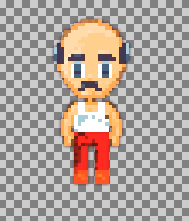
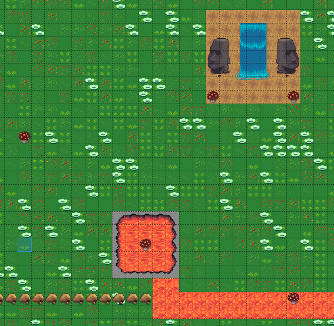

  <a>
    
  

  </a>

  <h2 align="center">Suriva Noroc RPG Game</h2>
  <h3 align="center">Built with JavaScript using the Phaser 3 Library</h3>

  

    <a href="https://github.com/Azeem838/suriva-noroc-rpg/issues">Report Bug</a>
    · 
    <a href="https://github.com/Azeem838/suriva-noroc-rpg/issues">Request Feature</a>
  

<!-- TABLE OF CONTENTS -->

## Table of Contents

- [About the Project](#about-the-project)
- [Installation](#installation)
- [Control's](#CONTROL'S)
- [Live Link](#Live-Link)
- [Built With](#built-with)
- [Potential Future Updates](#potential-future-updates)
- [Contact](#Authors)
- [Acknowledgements](#acknowledgements)

<!-- ABOUT THE PROJECT -->

## About The Project

Welcome to the Suriva Noroc RPG Game. This game is inspired by the events that are taking place throughout the world. You will be a doctor trying to kill the Suriva Noroc virus!

This game has many waves, try to get the highest score to beat the virus!

Hint: Don't waste the Mushrooms!

<!-- CONTROL'S -->

## How to play

### Controls

- (A) letter A => Move left
- (D) letter D => Move right
- (W) letter W => Move up
- (S) letter S => Move down
- (Space) SpaceBar => Shoot

<!-- Live Link  -->

## Live Link

[Click here](http://azeemahmed.me/suriva-noroc-rpg/)

<!-- INSTALLATION -->

## Installation

To get a local copy up and running follow these simple example steps.

### Prerequisites

Have a browser installed

### Setup

Clone this repo with <code>git@github.com:Azeem838/suriva-noroc-rpg.git</code>

### Usage - Follow these

1. <code>cd</code> into the project directory
2. run <code>npm install</code>
4. Navigate to [localhost:8000](http://localhost:8000) in your browser.
5. Enjoy :smiley:

<!-- BUILD WITH -->

## Built With

- HTML/CSS
- JavaScript (ES6)
- Phaser 3
- Webpack
- Eslint
- Stylelint
- Jest for testing
- Tiled to create the map

## Game Design

This game has 3 main images that bring it to life:

1. The doctor: 

  

2. The map created in Tiled (A beautiful waterfall and lava area with healing mushrooms :smiley:):

  

3. The Suriva Virus:

  

## Game Play

You are a doctor in a weird world where lava and waterfalls exist together in close proximity. There has been an outbreak of the Novel Suriva virus and you have been given the task by your community to kill the virus before it makes its way into town.

You take 100 health and head to the outskirts of your city (where lava meets waterfall) armed with a small laser beam that kills the virus on impact. When you make contact with this virus, you notice that your immune system only fights it off for 2 seconds at a time, however, this strips 50% of your health. You also notice that eating the special mushrooms around you increases your health by varying amounts.

### Objective

This game has 1 object - Kill as much of the Suriva virus as possible. Initially, there will be a few infections but as you get more proficient in killing Suriva, more will come!

Try to get to the highest wave possible and remember that there is a limited supply of special Mushrooms!

Don't forget to post your score to the global leaderboard.

## Authors

:bust_in_silhouette: **Azeem Ahmed**

- Github: [@Azeem838](https://github.com/Azeem838)
- LinkedIn: [Azeem Ahmed](www.linkedin.com/in/azeemmahmed)

## Show your support

Give a ⭐️ if you like this project!

## 📝 License

This project is [MIT](https://opensource.org/licenses/MIT) licensed.
